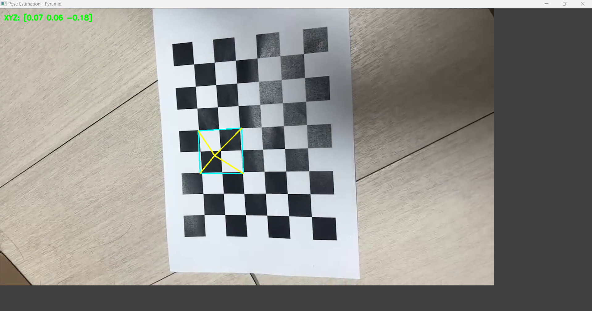

# Pose-estimation-with-calibration
Camera pose estimation with calibration using openCV

## Camera Calibration Results
* The number of selected images = 15
* RMS error = 0.6191721780389049
* Camera matrix (K) =
[[1.05793530e+03 0.00000000e+00 6.45266719e+02]
 [0.00000000e+00 1.05341689e+03 3.60188316e+02]
 [0.00000000e+00 0.00000000e+00 1.00000000e+00]]
* Distortion coefficient = [ 1.47108155e-01 -1.43647669e-02  4.23282973e-04  2.39088694e-03
 -1.49523801e+00]

 ## 📸 결과 이미지
